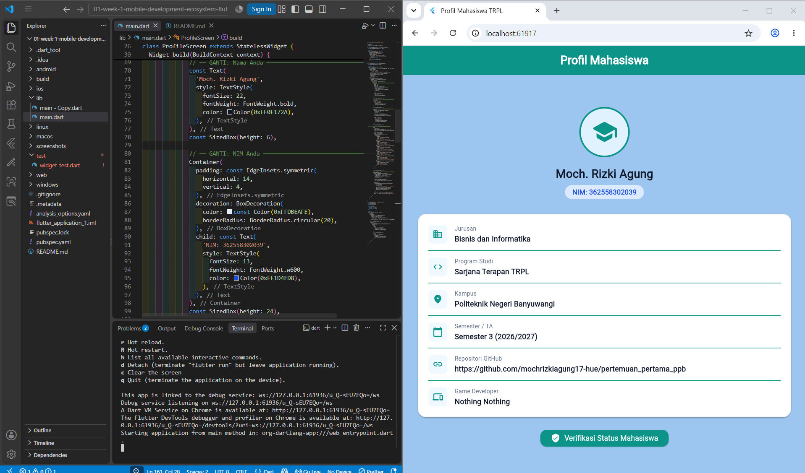
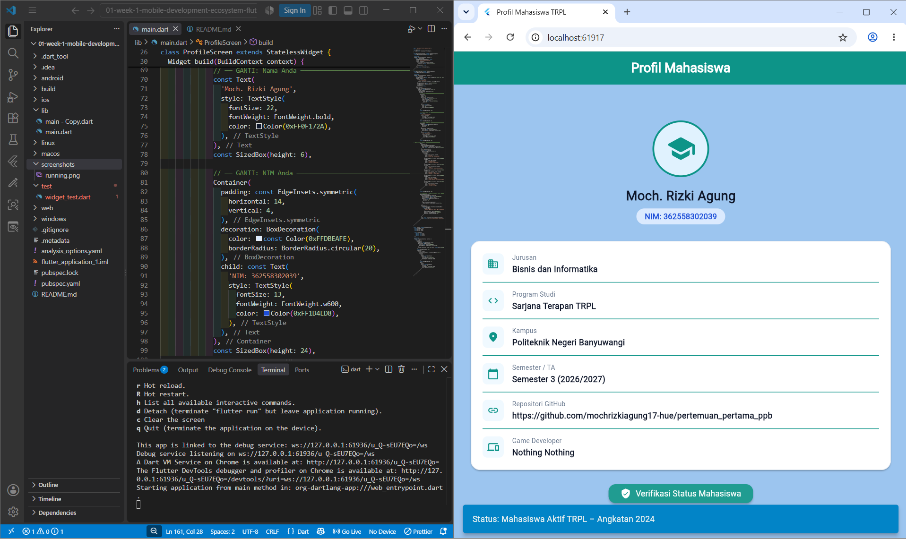

# Laporan Praktikum Modul 01: Mobile Ecosystem, Flutter Setup & Profile App

- **Nama**: Moch. Rizki Agung
- **NIM**: 362558302039
- **Kelas / Prodi**: 2C / Sarjana Terapan TRPL
- **Mata Kuliah**: Pemrograman Perangkat Bergerak (Semester 3)

---

## 1. Ringkasan Aktivitas
saya mempelajari dasar dari penggunaan flutter, seperti runing nya yang berbeda, dan bagaimana fluuter bisa di hubungkan ke hp secara langsung untuk melihat hasil atau perubahan nya

## 2. Bukti Tangkapan Layar (Running App)
[Sertakan minimal 2 screenshot bukti aplikasi profil berjalan di emulator atau HP fisik Anda]

## 3. Kendala yang Dihadapi & Solusinya
- **Kendala**: saya sebelumnya ingin menggunakan aplikasi android studio, tetapi karena berbagai alsan, seperti memakan ruang, aplikasi yang cukup berat, dan kebayakan teman yang memilih menggunanakn visual studio code.
- **Solusi**: pada akhirnya saya memilih untuk menggunakan visual studio code juga agar memudahkan shering ke depannya dengan teman teman lain nya.

- **Kendala**: sempat terjadi masalah dimana path flutter tidak kunjung terbaca
- **Solusi**: solusinya adalah dengan memindahkan urutan path flutter menjadi berada di paling atas seluruh path

## 4. Jawaban Pertanyaan Refleksi
1. **Pilihan Native vs Flutter**: B. 
Dart JIT (Just-In-Time) mengompilasi kode saat runtime sehingga perubahan bisa diinjeksi ke memori Dart VM dalam hitungan milidetik — inilah yang membuat Hot Reload bisa bekerja. Dart AOT (Ahead-Of-Time) mengompilasi seluruh program ke binary mesin native sebelum distribusi, menghasilkan startup lebih cepat dan performa runtime tanpa overhead interpreter. Ini yang membuat Flutter bisa mencapai 60–120 FPS konsisten di perangkat real.

2. **Prinsip UI = f(state)**: C. 
Dari docs.flutter.dev: 'In the declarative style, UI is a function of state.' Artinya developer hanya mendeklarasikan seperti apa UI saat state tertentu — Flutter yang mengurus rendering ulang. Ini berbeda dengan pendekatan imperatif Android (Kotlin) di mana developer harus menemukan view lalu mengubahnya secara manual (findViewById + setText). Flutter melakukan reconciliation (membandingkan widget tree lama vs baru) dan hanya memperbarui bagian yang berubah.
3. **Pentingnya Conventional Commits**: B.
Operator ?. (null-aware call) memeriksa apakah bio null sebelum memanggil .toUpperCase(). Karena bio null, ekspresi bio?.toUpperCase() mengembalikan null (bukan throw exception). Operator ?? (null-coalescing) kemudian memberikan nilai di kanan ('BELUM ADA') karena sisi kirinya adalah null. Output: 'BELUM ADA'. Inilah esensi Sound Null Safety Dart — program tetap berjalan aman tanpa crash.

4. **kapan menggunakan hot restart(R) di banding hot reload (r)**: B.
Hot Reload hanya menginjeksi delta kode ke Dart VM yang sedang berjalan — cocok untuk perubahan UI widget (teks, warna, layout, ukuran). Hot Restart diperlukan ketika: (1) menambahkan plugin baru (butuh reinisialisasi native channel), (2) mengubah initState() karena sudah dieksekusi sebelum hot reload, (3) mengubah main() atau root App widget, (4) variabel final/const yang dideklarasikan di luar widget berubah. Jika hot reload tidak berhasil, terminal akan menampilkan pesan 'Unable to hot reload' sebagai petunjuk.